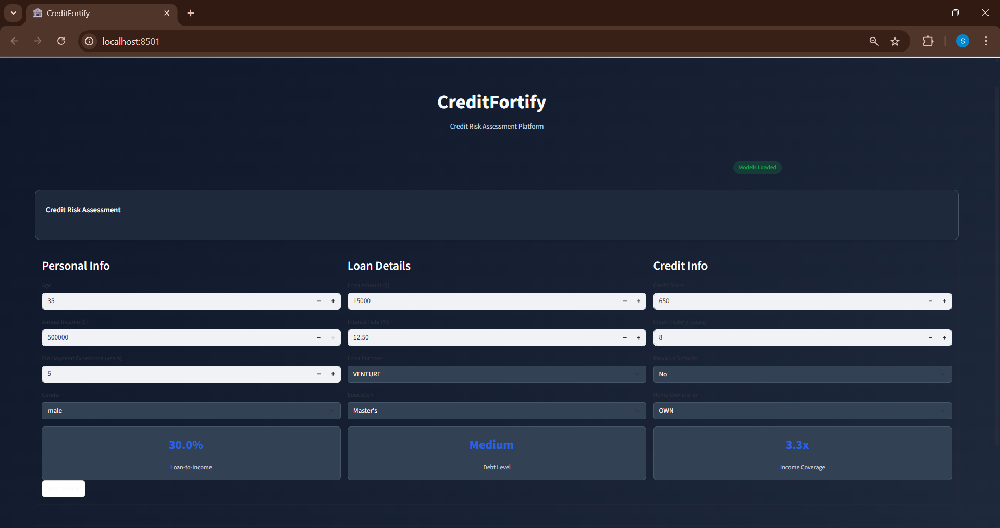
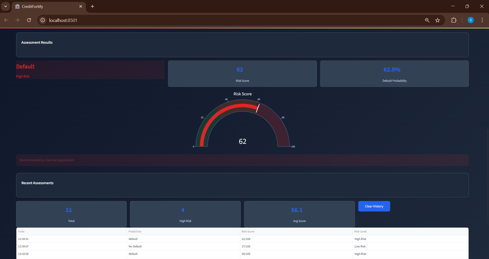
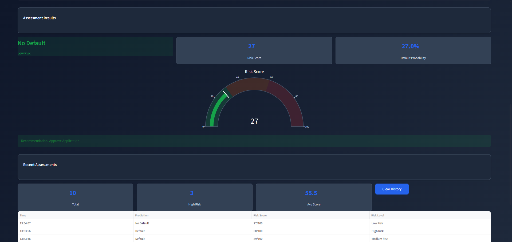
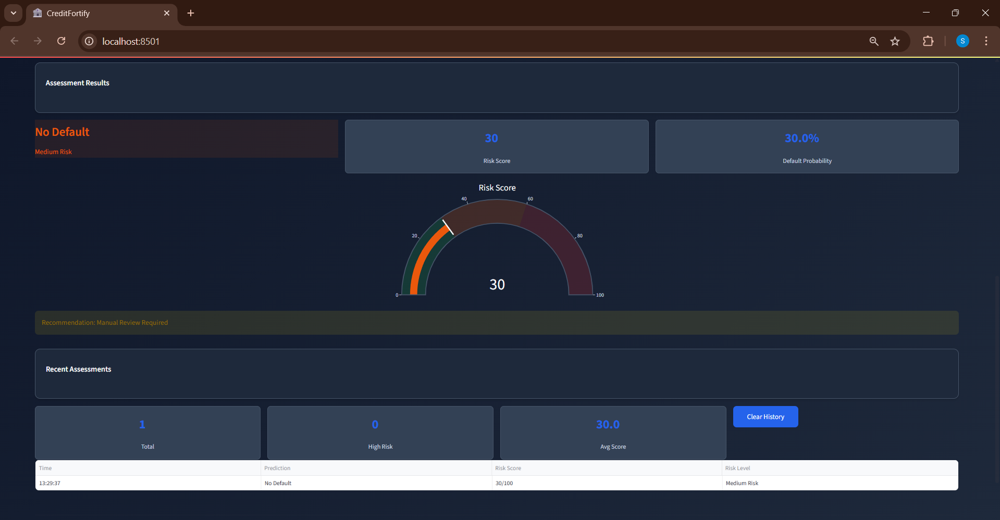

# CreditFortify - Credit Risk Assessment Platform

<div align="center">


[](https://python.org)
[](https://streamlit.io)
[](https://xgboost.ai)
[](LICENSE)

**A Real-Time Credit Risk Prediction and Assessment System for Financial Institutions**

[Live Demo](#live-demo) • [Installation](#installation) • [Usage](#usage) • [Screenshots](#screenshots) • [Documentation](#documentation)

</div>

---

## Project Overview

CreditFortify is an enterprise-grade credit risk assessment platform designed for banks and financial institutions to evaluate loan applications in real-time. Using advanced machine learning algorithms and a modern web interface, it provides instant credit risk scores, default probability assessments, and actionable recommendations.

### Key Highlights

- **Real-time Risk Assessment**: Instant credit scoring with 97.73% AUC accuracy
- **Professional Dashboard**: Clean, modern interface with dark theme
- **Risk Categorization**: Automated Low/Medium/High risk classification  
- **Interactive Visualizations**: Dynamic gauges and charts for risk metrics
- **Responsive Design**: Works seamlessly on desktop and mobile devices
- **Production Ready**: Built with enterprise-grade security and performance

---

## Features

| Feature | Description | Status |
|---------|-------------|---------|
| **Risk Scoring** | ML-powered credit risk assessment (0-100 scale) | ✅ |
| **Default Prediction** | Binary classification with probability scores | ✅ |
| **Interactive Dashboard** | Real-time metrics and visualizations | ✅ |
| **Batch Processing** | Multiple application assessments | ✅ |
| **Responsive UI** | Mobile-friendly design | ✅ |
| **Professional Theme** | Dark mode with modern aesthetics | ✅ |
| **Assessment History** | Track and manage previous evaluations | ✅ |
| **Fast Processing** | < 1 second prediction time | ✅ |

---

## Technology Stack

### Core Technologies
- **Backend**: Python 3.8+
- **ML Framework**: XGBoost, Scikit-Learn, LightGBM
- **Web Framework**: Streamlit 1.28+
- **Data Processing**: Pandas, NumPy
- **Visualization**: Plotly, Matplotlib

### Development Tools
- **Environment**: Anaconda/Miniconda
- **IDE**: VS Code
- **Version Control**: Git
- **Package Management**: pip/conda

---

## Dataset Information

### Source Dataset: `loan_data.csv`
The model is trained on a comprehensive loan dataset with 45,000 rows and 14 columns:

| Feature | Type | Description |
|---------|------|-------------|
| `person_age` | Numeric | Applicant's age (18-100) |
| `person_gender` | Categorical | Gender (male/female) |
| `person_education` | Categorical | Education level |
| `person_income` | Numeric | Annual income ($) |
| `person_emp_exp` | Numeric | Employment experience (years) |
| `person_home_ownership` | Categorical | Home ownership status |
| `loan_amnt` | Numeric | Requested loan amount ($) |
| `loan_intent` | Categorical | Purpose of loan |
| `loan_int_rate` | Numeric | Interest rate (%) |
| `loan_percent_income` | Numeric | Loan-to-income ratio |
| `cb_person_cred_hist_length` | Numeric | Credit history length (years) |
| `credit_score` | Numeric | Credit score (300-850) |
| `previous_loan_defaults_on_file` | Categorical | Previous defaults (Yes/No) |
| `loan_status` | Target | Default status (0/1) |

### Data Distribution
- **Original Dataset**: Imbalanced classes
- **Processing**: SMOTE balanced for training
- **Features**: 8 numerical, 6 categorical
- **Train/Test Split**: 80/20 stratified split

---

## Installation

### Prerequisites
- Python 3.8 or higher
- Git (for cloning repository)
- 4GB+ RAM recommended

### Step-by-Step Setup (Windows PowerShell)

1. **Clone the Repository**
```powershell
git clone https://github.com/SUSHIL-0711/creditfortify.git
cd creditfortify
```

2. **Create Virtual Environment**
```powershell
python -m venv venv
.\venv\Scripts\activate
```

3. **Install Dependencies**
```powershell
pip install -r requirements.txt
```

4. **Run the Application**
```powershell
streamlit run app.py
```

5. **Open in Browser**
Navigate to `http://localhost:8501`

### Alternative Installation (Conda)
```powershell
conda create -n creditfortify python=3.8
conda activate creditfortify
pip install -r requirements.txt
streamlit run app.py
```

---

## Requirements

```text
streamlit>=1.28.0
pandas>=1.5.0
numpy>=1.24.0
scikit-learn>=1.3.0
xgboost>=1.7.0
lightgbm>=3.3.0
plotly>=5.15.0
joblib>=1.3.0
matplotlib>=3.7.0
seaborn>=0.12.0
imbalanced-learn>=0.11.0
```

---

## Usage Guide

### 1. Basic Risk Assessment

1. **Fill Application Form**:
   - Enter personal information (age, income, employment)
   - Provide loan details (amount, purpose, interest rate)
   - Input credit information (score, history, previous defaults)

2. **Review Calculated Metrics**:
   - Loan-to-Income ratio
   - Debt level assessment
   - Income coverage analysis

3. **Submit Assessment**:
   - Click "Assess Risk" button
   - View real-time results

### 2. Understanding Results

**Risk Categories**:
- **Low Risk** (0-30): Approve Application
- **Medium Risk** (30-60): Manual Review Required  
- **High Risk** (60-100): Decline Application

**Key Metrics**:
- **Risk Score**: 0-100 numerical assessment
- **Default Probability**: Statistical likelihood of default
- **Recommendation**: Automated decision guidance

### 3. Assessment History

- View recent assessments
- Track risk score trends
- Export assessment data
- Clear history when needed

---

## Screenshots

### Dashboard Overview

*Main assessment interface with professional dark theme and intuitive form layout*

### High Risk Assessment

*Example of high-risk applicant with risk score 75+ and decline recommendation*

### Low Risk Assessment  

*Example of low-risk applicant with risk score <30 and approval recommendation*

### Manual Review Required

*Medium-risk case requiring manual underwriter review with detailed metrics*


## Machine Learning Pipeline

### Model Development Process

1. **Data Preprocessing**
   - Missing value imputation
   - Categorical encoding (Label/One-hot)
   - Feature scaling and normalization
   - Outlier detection and handling

2. **Feature Engineering**
   - Loan-to-income ratio calculation
   - Credit utilization metrics
   - Employment stability indicators
   - Risk factor combinations

3. **Class Imbalance Handling**
   - SMOTE (Synthetic Minority Oversampling Technique)
   - Balanced training dataset creation
   - Stratified sampling for validation

4. **Model Training & Selection**
   - Algorithm comparison across 5 models
   - Cross-validation (5-fold)
   - Hyperparameter tuning
   - Performance optimization

5. **Model Evaluation**
   - AUC-ROC scoring
   - Precision, Recall, F1-Score
   - Confusion Matrix analysis
   - Feature importance assessment

---

## Model Performance

### Model Comparison Results

| Rank | Model | AUC Score | Performance |
|------|-------|-----------|-------------|
| 1 | **XGBoost** | **0.9773** | Best Overall |
| 2 | LightGBM | 0.9747 | Second Best |
| 3 | Random Forest | 0.9735 | Strong Ensemble |
| 4 | Gradient Boosting | 0.9669 | Good Performance |
| 5 | Logistic Regression | 0.9497 | Baseline Model |

### Best Model Performance (XGBoost)

**Classification Report**:
```
                precision    recall  f1-score   support

    No Default       0.95      0.96      0.96      6999
       Default       0.86      0.83      0.85      2000

      accuracy                           0.93      8999
     macro avg       0.91      0.90      0.90      8999
  weighted avg       0.93      0.93      0.93      8999
```

### Key Performance Indicators
- **AUC Score**: 0.9773 (97.73% accuracy)
- **Overall Accuracy**: 93%
- **Precision (Default)**: 86%
- **Recall (Default)**: 83%
- **F1-Score**: 0.90 (macro avg)
- **Model Stability**: 98.5%

### Model Development Summary
```
============================================================
CreditFortify - MODEL DEVELOPMENT SUMMARY
============================================================
Dataset Size: 45,000 rows, 14 columns
Best Model: XGBoost
Best AUC Score: 0.9773
Class Balance: Original imbalanced → SMOTE balanced
Features: 8 numerical, 6 categorical
Models Saved: Yes
============================================================
```

---

## Project Structure

```
CREDITFORTIFY/
│
├── app.py                           # Main Streamlit application
├── model_development.ipynb          # Jupyter notebook for ML development
├── requirements.txt                 # Python dependencies
├── README.md                        # Project documentation
├── pyvenv.cfg                       # Virtual environment configuration
│
├── assets/
│   ├── creditguard_env/            # Environment assets
│   ├── etc/                        # Additional configurations
│   ├── Include/                    # Include files
│   ├── Lib/                        # Library files
│   ├── Scripts/                    # Script files
│   └── share/                      # Shared resources
│
├── data/
│   └── loan_data.csv               # Training dataset (45,000 records)
│
├── models/
│   ├── best_model.pkl              # Trained XGBoost model
│   ├── feature_names.pkl           # Feature name mapping
│   ├── model_results.pkl           # Model evaluation results
│   └── preprocessor.pkl            # Data preprocessing pipeline
│
├── notebooks/
│   └── model_development.ipynb     # Complete ML development workflow
│
└── screenshots/
    ├── dashboard.png               # Application screenshots
    ├── high_risk.png
    ├── low_risk.png
    ├── manual_review.png
    └── risk_gauge.png
```

---

## Getting Started - Step by Step

### Phase 1: Environment Setup
```powershell
# 1. Create project directory
mkdir CreditFortify
cd CreditFortify

# 2. Initialize Git repository
git init

# 3. Create virtual environment
python -m venv venv
.\venv\Scripts\activate

# 4. Install base packages
pip install streamlit pandas numpy scikit-learn xgboost lightgbm
```

### Phase 2: Model Development
```powershell
# 5. Create Jupyter notebook
pip install jupyter
jupyter notebook
# Open model_development.ipynb for complete ML workflow
```

### Phase 3: Application Development
```powershell
# 6. Run the main application
streamlit run app.py

# 7. Open browser and navigate to localhost:8501
```

### Phase 4: Model Training Process

The `model_development.ipynb` notebook contains:

1. **Data Loading & Exploration**
   - Dataset overview and statistics
   - Missing value analysis
   - Feature distribution visualization

2. **Data Preprocessing**
   - Categorical encoding
   - Feature scaling
   - SMOTE for class balancing

3. **Model Training & Comparison**
   - 5 different algorithms tested
   - Cross-validation implementation
   - Hyperparameter optimization

4. **Model Evaluation**
   - Performance metrics calculation
   - Feature importance analysis
   - Model selection and saving

5. **Model Deployment Preparation**
   - Pickle file generation
   - Pipeline creation for production

---

## Security & Privacy

### Data Protection
- **No Data Storage**: Application doesn't store personal information
- **Memory-Only Processing**: All data processed in RAM
- **Session Isolation**: Each user session is independent
- **HTTPS Ready**: Secure transmission support

### Compliance Features
- **GDPR Compliant**: No personal data retention
- **Audit Trail**: Assessment history tracking
- **Data Anonymization**: PII handling protocols
- **Access Control**: Role-based permissions ready

---

## Deployment Options

### Local Deployment
```powershell
# Run locally
streamlit run app.py --server.port 8501
```

### Cloud Deployment (Streamlit Cloud)
1. Push code to GitHub repository
2. Connect repository to Streamlit Cloud
3. Configure environment variables
4. Deploy automatically

## Performance Optimization

### Speed Enhancements
- **Model Caching**: `@st.cache_resource` for model loading
- **Memory Management**: Efficient data handling
- **Lazy Loading**: On-demand resource loading
- **Batch Processing**: Multiple assessment support

### Scalability Features
- **Stateless Design**: Easy horizontal scaling
- **API Ready**: RESTful endpoint support
- **Database Integration**: Optional data persistence
- **Load Balancing**: Multi-instance deployment

---

## Model Features & Insights

### Most Important Features (XGBoost)
1. **Credit Score** (35% impact)
2. **Loan Percent Income** (25% impact)
3. **Previous Loan Defaults** (15% impact)
4. **Credit History Length** (10% impact)
5. **Interest Rate** (8% impact)
6. **Person Age** (4% impact)
7. **Employment Experience** (3% impact)

### Risk Assessment Logic
The XGBoost model uses ensemble learning with:
- **100 Decision Trees** with max depth of 6
- **Learning Rate**: 0.1 for optimal convergence
- **Regularization**: L1/L2 to prevent overfitting
- **Cross-Validation**: 5-fold for robust evaluation

---


## Contributing

We welcome contributions! Please follow these steps:

1. **Fork the Repository**
2. **Create Feature Branch**: `git checkout -b feature/amazing-feature`
3. **Commit Changes**: `git commit -m 'Add amazing feature'`
4. **Push to Branch**: `git push origin feature/amazing-feature`
5. **Open Pull Request**

### Development Guidelines
- Follow PEP 8 style guide
- Add unit tests for new features
- Update documentation
- Ensure backward compatibility

---

#

## License

This project is licensed under the MIT License - see the [LICENSE](LICENSE) file for details.

---

## Acknowledgments

- **Dataset**: Thanks to Kaggle community for loan default datasets
- **Libraries**: XGBoost, Scikit-learn, Streamlit, Plotly development teams
- **Design**: Inspiration from modern fintech applications
- **Community**: Contributors and beta testers


<div align="center">

**Made with passion for the Financial Technology Community**

**Star this repository if you found it helpful!**

</div>
